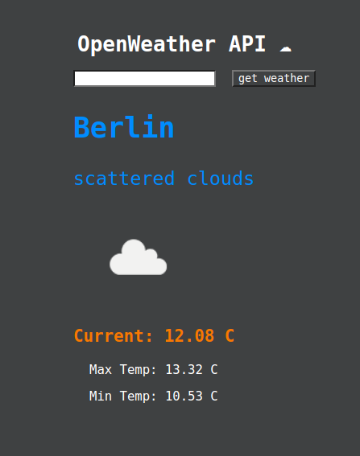

fetched weather api @ https://openweathermap.org/
hide API_KEY in .env

-----utilized Life-cycle Methods------
componentDidMount(), render() - Mounting phase
shouldComponentUpdate(nextProps,nextState), render() - Update phase

targeted input field with the reference key: createRef in REACT

